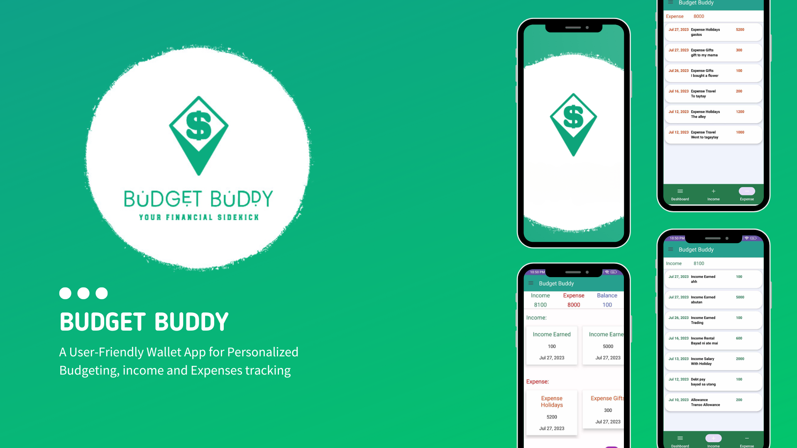
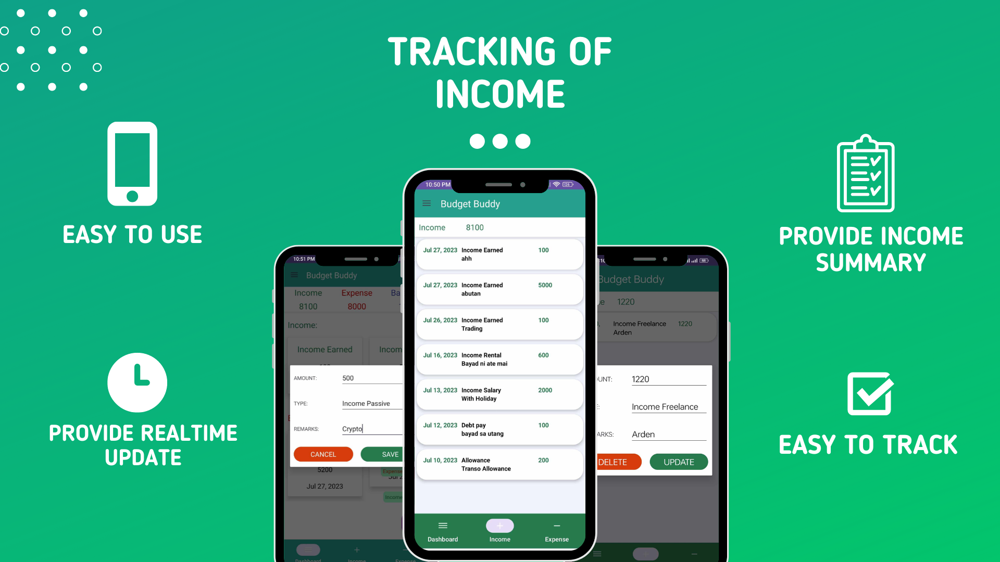
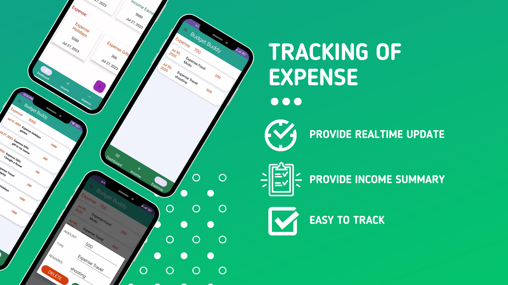
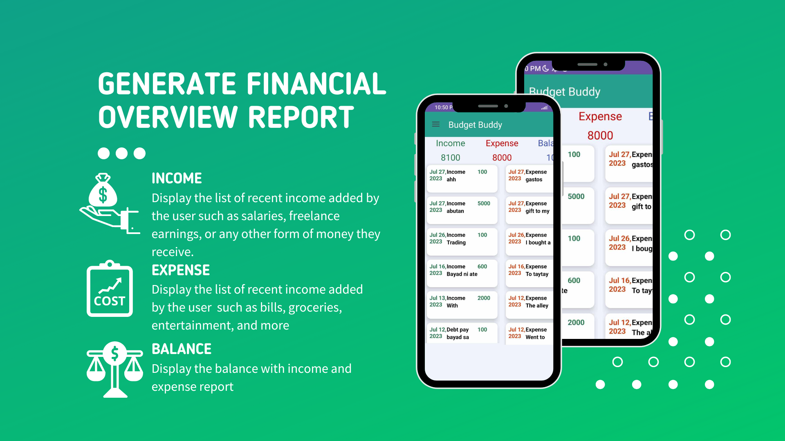
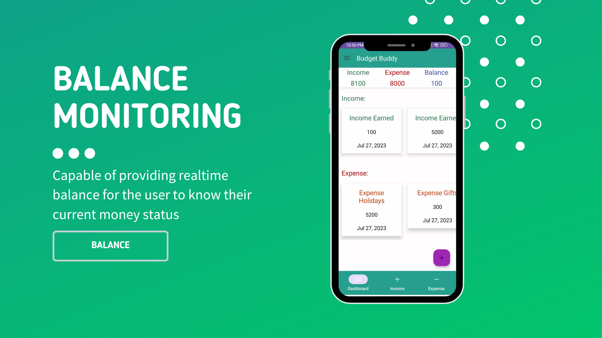
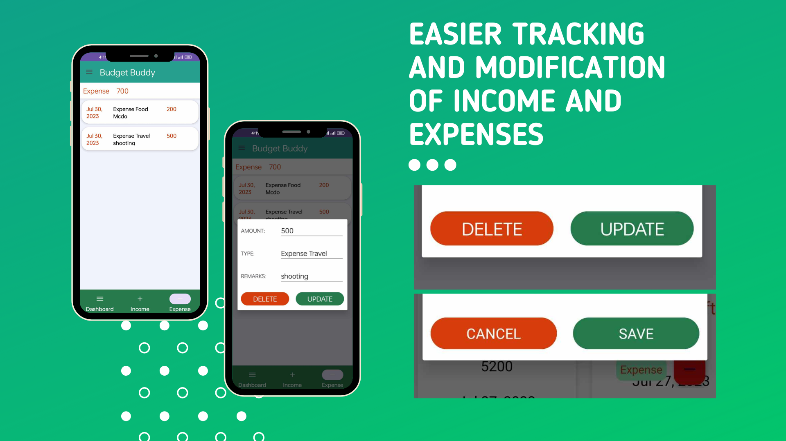

# Budget Buddy

 This study revolves around Personal finance management mobile application "Budget Buddy," which is designed to help people track their income and expenses. The application is tested and improved by user testing and following recommendations.  Furthermore, analyzed to see how well the app works and how it can be useful for everyone. The study highlights how "Budget Buddy" can empower users to manage their finances better, make informed decisions, and achieve greater financial stability, benefiting everyone of all ages.

## Overview

The application system development tools that is used by the proponents are Android studio connected to [Realtime Database](https://firebase.google.com/docs/database/) and [Authentication](https://firebase.google.com/docs/auth/) that furnishes a suitable environment to test and verify the working of the project.

## Requirements
*   Android Studio 4.0 (installed on a Mac, Linux, or Windows machine)
*   Android device in [developer mode](https://developer.android.com/studio/debug/dev-options) with USB debugging enabled
*   USB cable (to connect Android device to your computer)

## Features
### 1. Tracking of Income

  This feature allows users to input and monitor their sources of income, such as salaries, freelance earnings, or any other form of money they receive. By tracking their income, users can stay aware of how much money they are earning over time.
  

### 2. Tracking of Expense

  This feature enables users to log and manage their expenses effectively. They can record various types of expenses, such as bills, groceries, entertainment, and more. By keeping track of their spending, users gain insights into their financial habits and can identify areas where they might need to cut back or make adjustments.
  

### 3. Generate Financial Overview Report
  
  This feature compiles the income and expenses data to create a comprehensive financial overview report. The report may include insights on spending patterns, income sources, and other relevant financial metrics. It provides users with a clear snapshot of their overall financial health.
  

### 4. Realtime Money Balance Monitoring

  With this feature, users can instantly see their current money balance at any given time. It keeps them informed about how much money they have available after accounting for income and expenses, helping them avoid overspending and make more informed financial decisions.
  

### 5. User-friendly Interface 

  The budgeting app comes with a user-friendly interface that is easy to navigate and understand. It offers intuitive features and a simple layout, making it accessible to users of all levels of tech-savviness. The user-friendly interface ensures a seamless budgeting experience, encouraging users to maintain consistent financial tracking and management.

## Demo Video
Click the link to watch https://youtu.be/isGAerr6FmI

## Researcher/Developer:
* Santos, Trina Kaye T.
* Cruz, Maynard Jay
* Tecson, Kenneth Gabriel G.
* Vargas, Marylyne L.

## Adviser: 
* Jefferson A. Costales

## School Name:
Eulogio "Amang" Rodriguez Insitute of Science and Technology

Nagtahan, Sampaloc, Manila, Philippines

College of Arts and Sciences

ITE Department

## Course: 
* Bachelor of Science in Information Technology

## Date: 
* July 30, 2023
